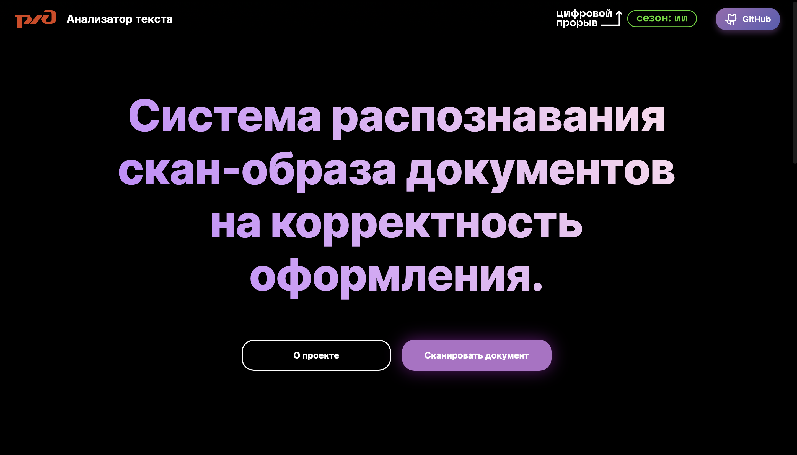

# РЖД Анализатор текста

## Описание решения

Кейс: Прием учетных документов

Партнер: РЖД

Веб-сайт содержит информацию о команде и проекте, описание возможностей и ссылку на репозиторий решения. Также присутствует возможность онлайн-сканирования документов и дальнейшей проверки на потенциальные ошибки.

#### Хакатон "Цифровой прорыв". Сочи, 13.10.2023 – 15.10.2023
